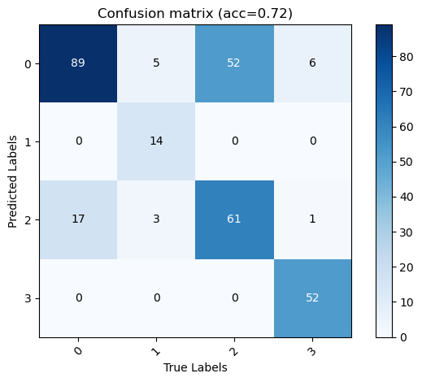
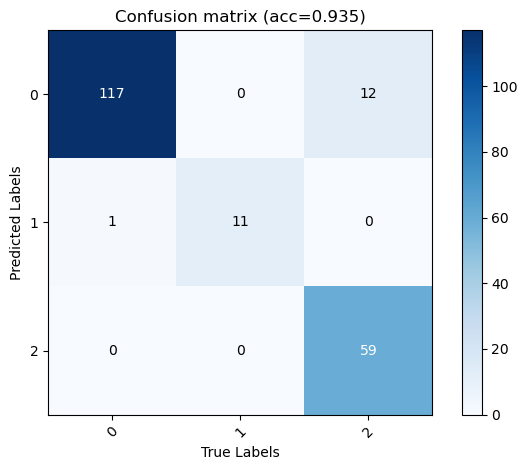

# ONCE context detection

## Contents  
- [Background](#Background) 
- [Environment](#Environment)
- [Structure](#Structure)  
- [Download](#Download) 
- [Usage Description](#Usage-Description)
- [Parameters](#Parameters)
- [Results](#Results) 

## Background
* Implementation of CV develepment pipeline based on ONCE dataset.

## Environment
* Linux version 4.15.0-175-generic
* Python 3.7.2
* Pytorch1.0.0.dev20190219


## Structure

  ├── [main.py](./main.py): Pipeline   
  ├── data: ONCE dataset  
  ├── [abstract](./abstract): Interfaces  
  ├────[datastruct.py](./abstract/datastruct.py)    
  ├────[dataset.py](./abstract/dataset.py)    
  ├────[preprocess.py](./abstract/preprocess.py)   
  ├────[model.py](./abstract/model.py)  
  ├────[optimizer.py](./abstract/optimizer.py)  
  ├────[process.py](./abstract/process.py)  
  ├── [once](./once): Abstracts and Instances of Interfaces  
  ├────[oncedatastruct.py](./once/oncedatastruct.py)   
  ├────[oncedataset.py](./once/oncedataset.py)  
  ├────[oncepreprocess.py](./once/oncepreprocess.py)  
  ├────[oncemodel.py](./once/oncemodel.py)  
  ├────[onceoptimizer.py](./once/onceoptimizer.py)  
  └────[onceprocess.py](./once/onceprocess.py)  

## Download
* [ONCE Dataset download here](https://once-for-auto-driving.github.io/download.html#downloads)
* Unzip ONCE dataset and store it according to 'Data orgainization' requirements


## Usage Description
* Run main.py
* Enjoy and have fun! 

## Parameters
* 1000 images were randomly selected from the ONCE dataset as dataset.  [oncedataset.py](./once/oncedataset.py) line 37  
* The data is divided into training set, validation set and test set. The ratio is 3:1:1.  [oncepreprocess.py](./once/oncepreprocess.py) function:before train line 12  
* The model is transformed from the pre-trained resnet18. The first 7 layers are kept and an additional pooling layer and two linear outputs are added. [oncemodel.py](./once/oncemodel.py) function:__init__ line 11  
* Epoch and batch size are default. [onceoptimizer.py](./once/onceoptimizer.py) function:__init__ line 23 


## Results
* Train accuracy curve

* Train loss curve

* Weather validation confusion matrix

* Period validation confusion matrix

* Weather Test confusion matrix

* Period Test confusion matrix


* Results in cmd
```
period class distribution {'morning': 358, 'noon': 77, 'afternoon': 391, 'night': 174}
weather class distribution {'sunny': 588, 'cloudy': 53, 'rainy': 359}
Forward compete in 4.0m 32.60341501235962s
epoch    0, loss: 0.6006, weather: 0.9844, period: 0.8911
epoch    1, loss: 0.3882, weather: 0.9938, period: 0.9307
epoch    2, loss: 0.1388, weather: 0.9922, period: 0.9563
epoch    3, loss: 0.1281, weather: 0.9984, period: 0.9646
epoch    4, loss: 0.2007, weather: 1.0000, period: 0.9708
epoch    5, loss: 0.0502, weather: 0.9969, period: 0.9859
epoch    6, loss: 0.1175, weather: 0.9938, period: 0.9672
epoch    7, loss: 0.0335, weather: 0.9984, period: 0.9859
epoch    8, loss: 0.0677, weather: 0.9922, period: 0.9859
epoch    9, loss: 0.0271, weather: 1.0000, period: 0.9880
---  There is this folder!  ---
Train compete in 3.0m 33.39098334312439s
------------------------------------------------------------------------
Val  loss: 1.3865, weather: 0.9336, period: 0.6992

Accuracy of morning : 91 %
Accuracy of  noon : 87 %
Accuracy of afternoon : 42 %
Accuracy of night : 89 %
----------
Accuracy of sunny : 96 %
Accuracy of cloudy : 100 %
Accuracy of rainy : 80 %
period creterion
+---+-----------+--------+-------------+-------+
|   | Precision | Recall | Specificity |   F1  |
+---+-----------+--------+-------------+-------+
| 0 |   0.598   | 0.914  |    0.669    | 0.723 |
| 1 |    0.56   | 0.875  |     0.94    | 0.683 |
| 2 |   0.943   | 0.429  |    0.984    | 0.589 |
| 3 |    1.0    | 0.892  |     1.0     | 0.943 |
+---+-----------+--------+-------------+-------+
weather creterion
+---+-----------+--------+-------------+-------+
|   | Precision | Recall | Specificity |   F1  |
+---+-----------+--------+-------------+-------+
| 0 |   0.902   | 0.967  |    0.831    | 0.933 |
| 1 |   0.733   |  1.0   |    0.979    | 0.846 |
| 2 |    1.0    | 0.803  |     1.0     | 0.891 |
+---+-----------+--------+-------------+-------+
Val compete in 0.0m 15.559977769851685s
------------------------------------------------------------------------
Test  loss: 1.5291, weather: 0.9492, period: 0.7031

Accuracy of morning : 95 %
Accuracy of  noon : 75 %
Accuracy of afternoon : 37 %
Accuracy of night : 91 %
----------
Accuracy of sunny : 99 %
Accuracy of cloudy : 100 %
Accuracy of rainy : 83 %
period creterion
+---+-----------+--------+-------------+-------+
|   | Precision | Recall | Specificity |   F1  |
+---+-----------+--------+-------------+-------+
| 0 |   0.569   | 0.957  |    0.618    | 0.714 |
| 1 |   0.429   |  0.75  |    0.936    | 0.545 |
| 2 |    1.0    | 0.376  |     1.0     | 0.547 |
| 3 |    1.0    | 0.912  |     1.0     | 0.954 |
+---+-----------+--------+-------------+-------+
weather creterion
+---+-----------+--------+-------------+-------+
|   | Precision | Recall | Specificity |   F1  |
+---+-----------+--------+-------------+-------+
| 0 |   0.907   | 0.992  |    0.854    | 0.947 |
| 1 |   0.917   |  1.0   |    0.995    | 0.957 |
| 2 |    1.0    | 0.831  |     1.0     | 0.908 |
+---+-----------+--------+-------------+-------+
Test compete in 0.0m 23.578290224075317s
All compete in 8.0m 49.051748275756836s

```